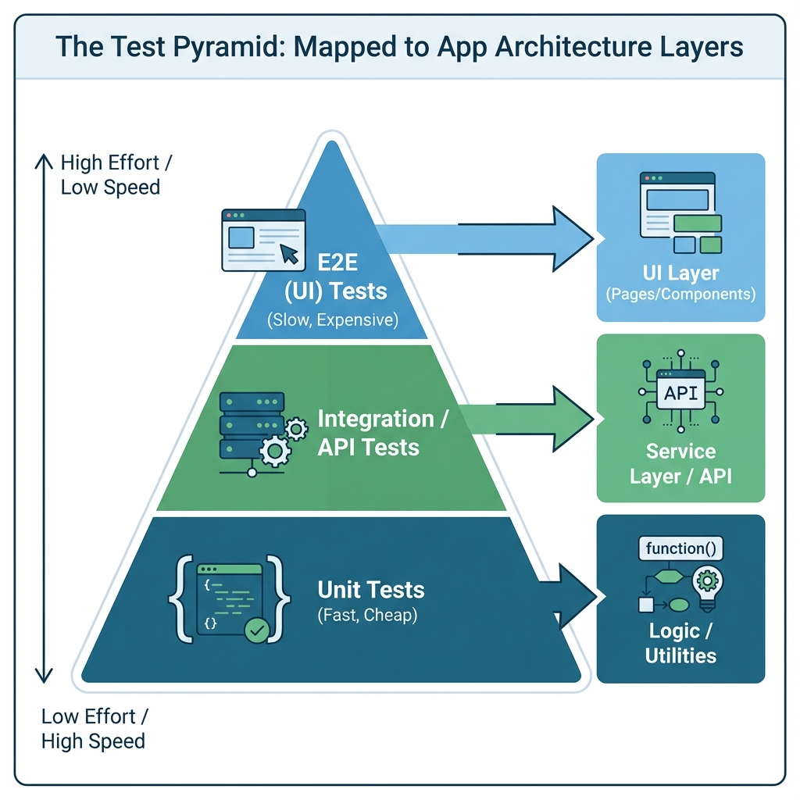

# 📘 QA Masterclass: Architektur & Mindset

Willkommen im Deep Dive! Dieses Dokument erklärt dir die **Zusammenhänge**, die einen modernen QA Engineer (Quality Assurance) ausmachen. Hier lernst du nicht *wie* man tippt, sondern *warum*.

Ziel ist es, das "Big Picture" von moderner Webentwicklung, Git-Workflows und Teststrategien (Testpyramide, Shift Left) zu verstehen.

---

## 🏗️ Teil 1: Die Anatomie einer modernen App

Als Tester arbeitest du nicht nur "auf der Oberfläche". Du musst verstehen, woraus die Anwendung besteht, um Fehlerursachen zu finden oder Testbarkeit einzufordern.

### 1. Der Bauplan (`package.json`)
Jedes moderne JavaScript/Node.js Projekt hat diese Datei. Sie ist das Herzstück.
*   **dependencies**: Die "Zutatenliste" der App. Hier siehst du, dass wir `next` (Next.js) und `react` nutzen.
*   **scripts**: Die "Bedienungsanleitung". Wenn du `npm run dev` tippst, schaut NPM hier nach, was eigentlich passieren soll (nämlich `next dev`).
*   **QA-Expertentipp:** Ein Blick hier rein verrät dir oft, welche Technologien genutzt werden, noch bevor du eine Zeile Code liest.

### 2. Git & GitHub: Dein Sicherheitsnetz 🛡️

Bevor wir über Code reden: Was ist Git überhaupt?
Stell dir Git als eine **Zeitmaschine** für deine Dateien vor.

*   **Git** (läuft auf deinem PC): Speichert jeden Zustand ("Commit") ab. Wenn du einen Fehler machst, kannst du zurückreisen.
*   **GitHub** (in der Cloud): Ist wie Google Drive für Code. Hier teilen wir unsere Zeitmaschinen-Daten mit dem Team.

**Der Workflow (in Bildern):**

1.  **`git add`**: Du packst Änderungen in einen "Karton" (Staging).
2.  **`git commit`**: Du klebst den Karton zu und beschriftest ihn ("Label"). Jetzt ist er in deiner lokalen Zeitmaschine gespeichert.
3.  **`git push`**: Du lädst den Karton in die Cloud (GitHub), damit andere ihn sehen.

Erst wenn du das verstanden hast, macht die `.gitignore` Datei Sinn: Sie ist eine Liste von Dingen, die *nicht* in den Karton dürfen (z.B. Müll oder Geheimnisse).

### 3. Der Filter (`.gitignore`)
Warum ist mein `node_modules` Ordner nicht auf GitHub?
*   Die `.gitignore` Datei sagt Git: "Ignoriere diese Dateien beim `git add`".
*   Das ist wichtig für:
    *   **Abhängigkeiten** (`node_modules`): Diese sind riesig (hunderte MB) und können jederzeit per `npm install` neu generiert werden. Sie gehören nicht ins Repo.
    *   **Secrets** (`.env`): Passwörter und API-Keys dürfen **niemals** hochgeladen werden.
    *   **Build-Artefakte** (`.next`, `test-results`): Temporäre Dateien.

### 3. Die Layer-Architektur (Model-View-Controller)
Unsere App (`src/`) ist sauber strukturiert. Ein Verständnis hiervon hilft dir, Tests besser zu schneiden.

*   **UI Layer (View)** -> `src/components` & `src/app`
    *   Hier liegt das, was der User sieht (Buttons, Header, Pages).
    *   *Test-Fokus:* Rendert der Button? Funktioniert der Klick? (E2E / Component Test)
*   **Service Layer (Logic)** -> `src/services` (`productService.ts`)
    *   Hier passiert die "Magie". Hier werden Daten geholt, gefiltert und berechnet.
    *   Beispiel: Die Suche nach "Watch" passiert hier, nicht im HTML.
    *   *Test-Fokus:* Funktioniert die Suche logisch korrekt? (Unit / Integration Test)
*   **Data Layer (Model)** -> `src/lib/data.ts`
    *   Unsere "Datenbank".

---

## 🔄 Teil 2: Agile QA & Shift Left

Früher ("Wasserfall") wurde entwickelt, und ganz am Ende wurde getestet.
Heute ("Agil") testen wir **kontinuierlich**. Das nennt man **"Shift Left"**: Das Testen rückt auf dem Zeitstrahl nach links (früher).

### Dein Workflow als Agile QA

1.  **Requirement (Die Anforderung)**
    *   Der Product Owner schreibt eine User Story (siehe README).
    *   **Deine Rolle:** Du prüfst die Story *bevor* Code geschrieben wird. "Ist das testbar?", "Fehlen Edge Cases?", "Brauchen wir Test-IDs?".

2.  **Implementation (Development)**
    *   Entwickler bauen das Feature.
    *   **Deine Rolle:** Du schreibst parallel schon deine automatisierten Tests (Test Automation Engineering).

3.  **Pull Request & Review**
    *   Der Entwickler will seinen Code in den `main` Branch bringen.
    *   **Deine Rolle:** Deine Pipeline läuft automatisch los. Wenn deine Tests rot sind ❌, darf der Entwickler nicht mergen. Du bist das Sicherheitsnetz.

---

## 🔼 Teil 3: Die Testpyramide

Nicht jeder Test muss ein E2E (Browser) Test sein. E2E Tests sind langsam, teuer und instabil ("flaky").
Diese Grafik zeigt dir, wie du deine Testing-Strategie aufbauen solltest:

**Die Pyramide (von unten nach oben):**

1.  **Unit Tests (Basis - Viele & Schnell)**
    *   Testen einzelne Funktionen (z.B. `productService.ts`).
    *   *Wer:* Entwickler.
    *   *Tool:* Vitest / Jest.
2.  **Integration Tests (Mitte)**
    *   Testen das Zusammenspiel (z.B. Service + Datenbank + API).
    *   *Wer:* Entwickler & QA.
3.  **E2E (End-to-End) Tests (Spitze - Wenige & Langsam)**
    *   Testen den kompletten User-Flow im Browser (Login -> Suche -> Kauf).
    *   *Wer:* QA (Du!).
    *   *Tool:* Playwright / Cypress.

**Wichtig:** Du schreibst hier E2E Tests. Aber du solltest wissen, dass du nicht *jeden* kleinen Logik-Baustein über die UI testen musst. Konzentriere dich auf die **User Journeys**.

---

## 🛠️ Teil 4: Modernes "Test Engineering"

Testautomatisierung ist Softwareentwicklung. Wir schreiben Code, um Code zu testen. Deshalb gelten für uns dieselben Clean-Code Regeln.

### Best Practice: Trennung der Anliegen (Page Object Model)
*   **Bad Practice:**
    `page.click('#btn-123')` direkt im Test.
    *Problem:* Wenn sich die ID ändert, musst du 50 Tests umschreiben.
*   **Good Practice (POM):**
    Du baust eine Klasse `LoginPage`. Darin gibt es eine Methode `login()`.
    Der Test ruft nur `LoginPage.login()` auf.
    *Vorteil:* Ändert sich der Button, änderst du nur **eine** Stelle in der `LoginPage`-Klasse.

### Best Practice: Testdaten Management
Harte Daten (`"Test User 1"`) machen Tests starr.
*   Nutze Variablen oder Config-Dateien.
*   Mache Tests unabhängig von der Umgebung (Localhost vs. Staging).

### Best Practice: Reporting
Ein Testlauf in der CI/CD Pipeline ("headless" in der Cloud) ist unsichtbar.
*   Konfiguriere **Traces**, **Videos** und **Screenshots** für fehlgeschlagene Tests.
*   Das ist dein "Beweismittel" und hilft beim Debuggen, ohne dass du den Fehler lokal nachstellen musst.

---

## 🎯 Teil 4.1: Exkurs - Die Kunst der Selektoren

Das Schwierigste für Umsteiger ist oft: "Wie sage ich dem Test, welches Element er klicken soll?"
Hier scheitern viele Tests (sie werden "flaky"), weil falsche Selektoren gewählt werden.

**Die Hierarchie der Stabilität:**

1.  🥇 **Gold Standard: User-Facing Attributes (`Role`, `Label`, `Text`)**
    *   *Code:* `page.getByRole('button', { name: 'Kaufen' })`
    *   *Warum:* Das testet so, wie ein echter User (oder Screenreader) die Seite sieht.
    *   *Bonus:* Du testest **Accessibility** (Barrierefreiheit) gratis mit! Wenn dein Test den Button nicht findet, findet ihn ein blinder Nutzer auch nicht.

2.  🥈 **Silber Standard: Test IDs (`data-testid`)**
    *   *Code:* `page.getByTestId('submit-order-btn')`
    *   *Warum:* Super robust, weil wir Entwickler diese ID extra für dich in den Code gebaut haben (`data-testid="..."`). Sie ändert sich selten.

3.  ☠️ **Das No-Go: XPath / CSS Spaghetti**
    *   *Code:* `page.locator('div > div:nth-child(3) > span > button')`
    *   *Warum:* Kopiere NIEMALS Pfade aus den Browser-Tools! Sobald ein Entwickler ein `div` verschiebt, bricht dein Test. Das ist **nicht wartbar**.

---

## 🚀 Teil 5: Die Pipeline (CI/CD) Verstehen

Wenn du manuell testest, bist du der Flaschenhals. In modernen Teams testet ein Roboter (die Pipeline) für uns.

### Was bedeuten die Abkürzungen?

1.  **CI (Continuous Integration):**
    *   *Idee:* Entwickler laden ihren Code mehrmals täglich hoch ("Merge").
    *   *Ziel:* Wir prüfen **bei jedem Upload** sofort: Lässt sich das bauen? Sind die Tests grün?
    *   *Warum:* Fehler werden nach 5 Minuten gefunden, nicht erst 3 Wochen später vor dem Release ("Fail Fast").

2.  **CD (Continuous Delivery):**
    *   *Idee:* Wenn die CI (Tests) grün ist, wird die Software **automatisch** auf ein Testsystem (Staging) geladen.
    *   *Ziel:* Die Software ist *jederzeit* bereit für den Kunden.

### Wie sieht eine Pipeline aus?

Stell dir ein Fliessband in einer Fabrik vor. Jeder Schritt ("Job") muss erfolgreich sein, damit es weitergeht.

1.  **Trigger:** Du machst `git push`. Das Band läuft los.
2.  **Build Job:** Der Server prüft: "Ist der Code syntaktisch korrekt?" (`npm run build`).
3.  **Test Job:** Der Server führt deine Playwright-Skripte aus.
4.  **Artifacts:** Wenn Tests fehlschlagen, speichert der Server Beweisfotos (Screenshots) als "Artifacts", die du herunterladen kannst.

### Deine Verantwortung als QA
In der CD-Welt bist du der **Gatekeeper**.
*   Früher: Du hast am Ende "OK" gesagt.
*   Heute: **Dein Code** (die Tests) sagt automatisch "OK".
*   Wenn deine Tests schlecht ("flaky") sind, stoppst du das ganze Team. Deshalb ist Stabilität wichtiger als Menge!

---

## 🎓 Fazit

Als moderner Test Consultant bist du nicht mehr derjenige, der am Ende manuell klickt.
Du bist der **Architekt der Qualität**. Du baust das Sicherheitsnetz (Pipeline), das dem Team erlaubt, schnell und sicher neue Features zu releasen.

Viel Erfolg bei deiner Mission! 🚀
